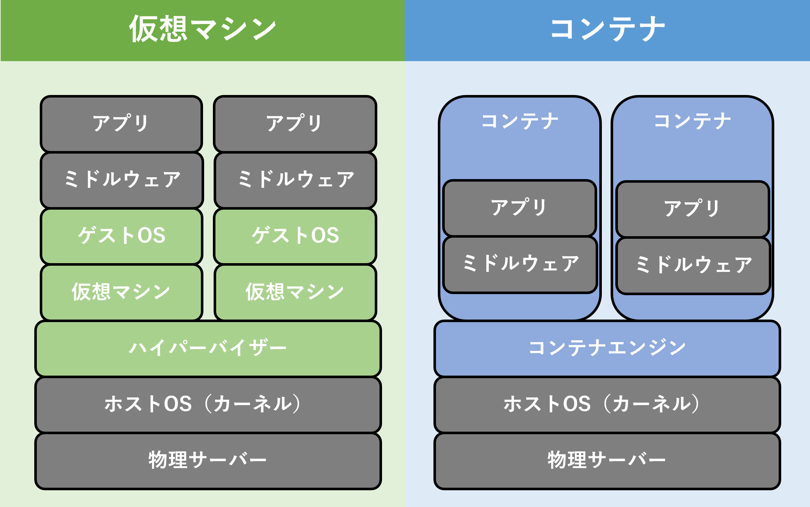
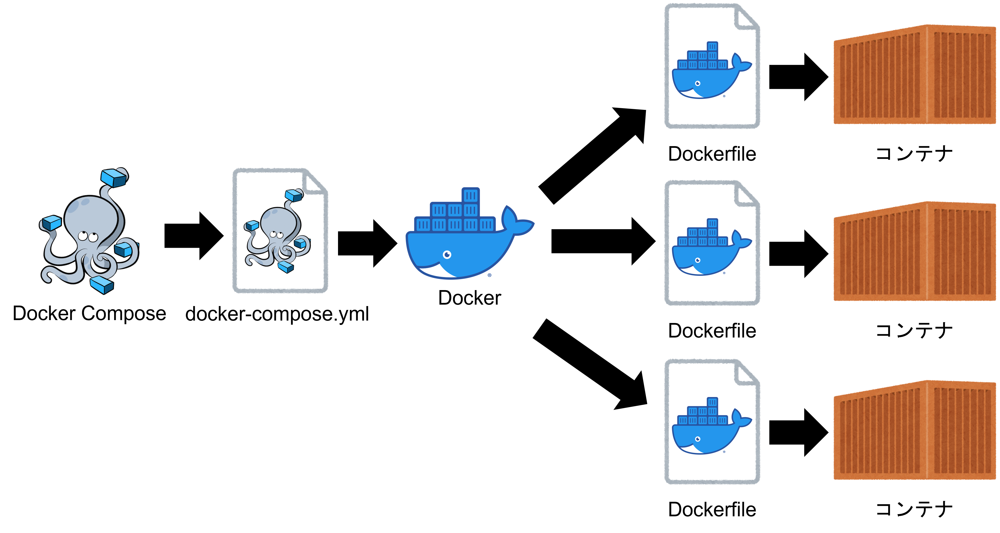

# Dockerとは？

Dockerとは、コンテナ技術を利用したアプリケーション開発、配布、運用を簡素化するためのオープンソースプラットフォームです。

コンテナとは、アプリケーションとその依存関係（ライブラリ、設定ファイルなど）を1つのパッケージにまとめる技術で、仮想化技術とは異なります。

コンテナは、アプリケーションの実行環境を隔離して提供するため、開発、テスト、本番環境間で一貫した動作を保証します。

## 従来の仮想化技術との違い

VirtualBoxやVMware等の従来の仮想化技術とDockerの違いは、主に仮想化技術のタイプとリソース消費量です。

VirtualBoxやVMwareはハイパーバイザ型の仮想化技術で、独立したゲストOSを提供しますが、リソース消費量が大きく、移植性に課題があります。

一方、Dockerはコンテナ型の仮想化技術で、軽量かつ高速な仮想環境を提供し、移植性や管理のしやすさが向上しています。

また、Dockerのエコシステムは拡大し続けており、多様なツールやプラットフォームが利用可能で、柔軟なアプリケーション開発や運用が可能です。



## Dockerの特徴

Dockerの主な利点は以下の通りです。

1. 環境の一貫性: コンテナはアプリケーションの実行環境を包括しているため、開発、テスト、本番環境間での環境差による問題を最小限に抑えます。これにより、開発者と運用担当者が、同じ環境で作業できるようになります。

2. 軽量性: Dockerコンテナは、仮想マシンとは異なり、ゲストOSを含まず、ホストOSのカーネルを共有して動作します。そのため、コンテナは起動が速く、リソース消費が少ないです。

3. 移植性: Dockerは多くのプラットフォーム（Linux、Windows、macOSなど）で利用でき、クラウド環境やオンプレミス環境での利用が容易です。Dockerコンテナはプラットフォーム間で移植可能であり、アプリケーションの展開や移行を簡単に行うことができます。

4. 再現性: Dockerイメージは、アプリケーションとその依存関係を1つにまとめたもので、バージョン管理が可能です。これにより、過去の状態に簡単に戻したり、同じバージョンの環境を複数人で共有したりすることができます。

5. マイクロサービスアーキテクチャの促進: Dockerは、アプリケーションを小さな独立したサービスに分割し、それぞれをコンテナ化することを容易にします。これにより、マイクロサービスアーキテクチャが推進され、開発と運用が効率化されます。各サービスは独立して開発、デプロイ、スケールすることができ、システム全体の柔軟性と可用性が向上します。

## Dockerのユースケース

Dockerのユースケースは以下の通りです。

1. 環境構築の簡素化
2. CI/CDパイプラインの統合
3. クラウド移行の容易化
4. ソフトウェアのバージョン管理
5. 開発・テスト環境の一貫性の確保
6. アプリケーションのスケーラビリティ向上
7. セキュリティの強化（プロセスやリソースの隔離）
8. システムのリソース効率化

### 1. 環境構築の簡素化

Dockerは、仮想化技術を利用してアプリケーション実行環境を提供するため、環境構築が簡単になります。

また、コンテナ化されたアプリケーションを実行するためのプラットフォームとして、Windows、Linux、macOSなど複数のプラットフォームをサポートしています。

プラットフォームの違いによる問題を抽象化し、アプリケーションの複数プラットフォーム対応を簡素化することができます。

具体的には、以下のようなメリットがあります。

- パッケージ管理の簡素化：Dockerは、アプリケーションとその依存関係を含むパッケージ化された単位であるコンテナを提供するため、パッケージ管理が簡素化されます。たとえば、アプリケーションの依存関係を手動でインストールする必要がなく、Dockerイメージを使用することで、必要な依存関係を含むパッケージ化された単位をダウンロードすることができます。
- ツールの共有化：Dockerは、複数の開発者が同じ実行環境を共有することができるため、ツールの共有化が簡単になります。たとえば、Dockerイメージに必要なツールやライブラリを含めることで、開発者が同じ実行環境を簡単に再現することができます。
- 簡単なアップグレード：Dockerは、コンテナによるアプリケーション実行環境を提供するため、アプリケーションのアップグレードが簡単になります。たとえば、新しいバージョンのアプリケーションを含むDockerイメージを作成し、古いバージョンのイメージを置き換えることで、アップグレードを実行することができます。
- コンテナのポータビリティ：Dockerコンテナは、アプリケーションとその依存関係を含むパッケージ化された単位です。コンテナは、ホストOSとは独立して動作するため、異なるプラットフォーム間での移植性が高くなります。
- マルチプラットフォームの開発：Dockerは、マルチプラットフォームの開発を容易にすることができます。Dockerfileを使用して、アプリケーションのビルドやパッケージングを自動化することができます。また、Docker Composeを使用することで、複数のコンテナを協調させることができます。
- テスト環境の共通化：Dockerは、開発環境とテスト環境を共通化することができます。コンテナには、必要なパッケージやツールが含まれており、環境構築の手順が自動化されています。これにより、開発者やテスト担当者は、環境の再現性を高めることができます。
- ホストOSの選択：Dockerを使用することで、アプリケーションを実行するためのホストOSを選択することができます。たとえば、Linuxベースのコンテナを使用してWindows上でアプリケーションを実行することができます。

### 2. CI/CDパイプラインの統合

CI/CDパイプラインは、ソフトウェアの開発やデプロイメントにおける一連の自動化されたプロセスです。

Dockerは、コンテナによるアプリケーション実行環境であり、CI/CDパイプラインの統合においても有用な技術です。

具体的には、以下のようなメリットがあります。

- 一貫性のある実行環境の提供：Dockerは、コンテナに必要なアプリケーションや依存関係を含むパッケージ化された単位です。これにより、開発、テスト、ステージング、本番環境などの各段階で同じ実行環境を提供することができます。
- テストの自動化：Dockerを使用することで、アプリケーションのテストを自動化することが容易になります。たとえば、Dockerコンテナを使用して、異なる環境でのテストを自動化することができます。
- デプロイメントの自動化：Dockerは、コンテナのポータビリティにより、デプロイメントを容易にします。たとえば、Kubernetesなどのオーケストレーションツールを使用することで、コンテナを自動的にデプロイすることができます。
- ビルドの自動化：Dockerは、Dockerfileという形式でアプリケーションのビルドを自動化することができます。Dockerfileを使用することで、開発者は、アプリケーションの依存関係や構成を含むパッケージ化された単位を作成することができます。
- バージョン管理の容易化：Dockerは、コンテナによるアプリケーション実行環境を提供するため、アプリケーションのバージョン管理を容易にします。たとえば、Dockerイメージを使用することで、特定のバージョンのアプリケーションをデプロイすることができます。

### 3. クラウド移行の容易化

Dockerコンテナは、オンプレミス環境からクラウド環境への移行を容易にすることができます。

具体的には、以下のようなメリットがあります。

- ポータブル性の高さ：Dockerコンテナは、アプリケーションとその依存関係が含まれており、環境を構築するために必要な手順が事前に定義されています。そのため、コンテナを移植することが簡単になります。
- クラウドプラットフォームのサポート：多くのクラウドプロバイダは、Dockerコンテナをサポートしており、コンテナを簡単にデプロイすることができます。
- デプロイの自動化：Dockerコンテナを使うことで、環境の差異を最小限に抑え、アプリケーションの正常な動作を確保することができます。また、CI/CDパイプラインを構築することで、デプロイを自動化することができます。
- オーケストレーションのサポート：オーケストレーションツール（例：Kubernetes）を使用することで、複数のDockerコンテナを自動的にデプロイ、スケール、管理することができます。

### 4. ソフトウェアのバージョン管理

Dockerは、アプリケーションとその依存関係を含むコンテナを提供するため、ソフトウェアのバージョン管理に役立ちます。

具体的には、以下のようなメリットがあります。

- コンテナのバージョン管理：Dockerコンテナは、バージョン番号を付与することができます。これにより、異なるバージョンのコンテナを同じ環境で実行することができ、複数のバージョンを同時にテストすることができます。
- コンテナのロールバック：Dockerコンテナを使用することで、バージョンの変更に伴うリスクを最小限に抑えることができます。コンテナの変更に問題があった場合、以前のバージョンに簡単にロールバックすることができます。
- イメージのバージョン管理：Dockerイメージは、コンテナを作成するためのテンプレートです。イメージにもバージョン番号を付与することができ、異なるバージョンのイメージを管理することができます。
- レジストリの管理：Dockerイメージは、Docker Hubと呼ばれる公式のレジストリにアップロードすることができます。レジストリには、各バージョンのイメージが保存されており、バージョン管理が容易になります。

### 5. 開発・テスト環境の一貫性の確保

Dockerを使うことで、開発・テスト環境の一貫性を確保することができます。

具体的には、以下のようなメリットがあります。

- 開発・テスト環境の共通化：Dockerコンテナにはアプリケーションとその依存関係が含まれており、環境を構築するために必要な手順が事前に定義されています。そのため、開発環境とテスト環境を共通化することができます。
- 環境構築の自動化：Dockerコンテナを使うことで、環境構築を自動化することができます。Dockerfileと呼ばれるテキストファイルにアプリケーションとその依存関係のパッケージ名やバージョンを記述することで、環境構築の手順を自動化することができます。
- 環境の再現性：Dockerコンテナを使うことで、開発者やテスト担当者は、環境の再現性を高めることができます。コンテナは、環境全体をパッケージ化しているため、同じコンテナを使って開発やテストを行うことができます。
- リソースの効率化：Dockerコンテナは、ホストOS上のリソースを効率的に利用することができます。複数のコンテナを同じホストOS上で実行することで、リソースの共有が可能になります。

### 6. アプリケーションのスケーラビリティ向上

Dockerを使うことで、アプリケーションのスケーラビリティを向上することができます。

具体的には、以下のようなメリットがあります。

- コンテナの独立性：Dockerコンテナは、独立して動作するため、コンテナ単位でスケールすることができます。必要に応じて、複数のコンテナを追加してスケールアップすることができます。
- オーケストレーションのサポート：オーケストレーションツール（例：Kubernetes）を使用することで、複数のコンテナを自動的にデプロイ、スケール、管理することができます。また、オートスケーリング機能を使用することで、負荷に応じてコンテナの数を自動的に調整することができます。
- ロードバランシング：複数のコンテナを同時に実行することで、負荷を分散することができます。ロードバランサを使用することで、コンテナへのトラフィックを分散することができます。
- リソースの効率化：Dockerコンテナは、ホストOS上のリソースを効率的に利用することができます。複数のコンテナを同じホストOS上で実行することで、リソースの共有が可能になり、スケールアップによるコスト増大を抑えることができます。

### 7. セキュリティの強化（プロセスやリソースの隔離）

Dockerは、コンテナ単位でアプリケーションを実行することで、プロセスやリソースの隔離を実現しています。

これにより、以下のようなセキュリティ上のメリットがあります。

- プロセスの隔離：Dockerコンテナは、ホストOS上で独自のプロセス空間を持ちます。これにより、コンテナ内で実行されるプロセスは、ホストOS上の他のプロセスと隔離され、攻撃者がコンテナ内のプロセスにアクセスすることを防ぎます。
- リソースの隔離：Dockerコンテナは、ホストOS上で独自のリソースを割り当てられます。コンテナ内で実行されるアプリケーションは、他のコンテナやホストOS上の他のプロセスから独立してリソースを利用することができます。これにより、コンテナ内で実行されるアプリケーションが、他のコンテナやホストOS上のプロセスに影響を与えることを防ぎます。
- イメージの検証：Dockerイメージには、アプリケーションとその依存関係が含まれています。イメージを作成する際に、パッケージの署名を検証することができます。これにより、信頼できないイメージからの攻撃を防ぎます。
- アプリケーションの制限：Dockerコンテナでは、アプリケーションが必要とするリソースを明確に定義することができます。これにより、アプリケーションがリソースを過剰に消費することを防ぎ、DoS攻撃などから保護します。

### 8. システムのリソース効率化

Dockerは、仮想化技術を利用したコンテナによるアプリケーション実行環境であり、システムのリソース効率化に貢献します。

具体的には、以下のようなメリットがあります。

- ホストOS上のリソースの共有：Dockerコンテナは、ホストOS上のリソースを共有することができます。複数のコンテナを同じホストOS上で実行することで、リソースの共有が可能になり、ホストOS上のリソースをより効率的に活用することができます。
- アプリケーションの軽量化：Dockerコンテナは、必要なアプリケーションとその依存関係だけを含んでいます。これにより、アプリケーションの軽量化が可能になり、システムのリソース効率化に貢献します。
- マイクロサービスアーキテクチャの採用：Dockerは、マイクロサービスアーキテクチャの採用を容易にします。マイクロサービスアーキテクチャでは、アプリケーションを小さな単位に分割し、それぞれを独立して実行することができます。Dockerコンテナを使用することで、それぞれのマイクロサービスを独立して実行することができ、システムのリソースをより効率的に活用することができます。

# Dockerのインストール方法

## Windows

## Mac

## Linux（Ubuntu）

1. パッケージをアップデートする
- コマンド
```
sudo apt-get update
```

- 実行例
```
$ sudo apt-get update
[sudo] password for ユーザ名:
ヒット:1 http://jp.archive.ubuntu.com/ubuntu focal InRelease
```

2. 必要なパッケージをインストールする
    - `Do you want to continue? [Y/n] ` が表示されたら、 `y` を入力する
- コマンド
```
sudo apt-get install apt-transport-https ca-certificates curl gnupg-agent software-properties-common
```

- 実行例
```
$ sudo apt-get install apt-transport-https ca-certificates curl gnupg-agent software-properties-common
パッケージリストを読み込んでいます... 完了
依存関係ツリーを作成しています
状態情報を読み取っています... 完了
```

3. キーを登録
- コマンド
```
curl -fsSL https://download.docker.com/linux/ubuntu/gpg | sudo apt-key
```

- 実行例
```
$ curl -fsSL https://download.docker.com/linux/ubuntu/gpg | sudo apt-key add -
OK
```

4. ダウンロードサイトをaptリポジトリに登録
- コマンド
```
$ sudo add-apt-repository "deb [arch=amd64] https://download.docker.com/linux/ubuntu $(lsb_release -cs) stable"
```

- 実行例
```
$ sudo add-apt-repository \
> "deb [arch=amd64] https://download.docker.com/linux/ubuntu \
> $(lsb_release -cs) \
> stable"
ヒット:1 http://jp.archive.ubuntu.com/ubuntu focal InRelease
取得:2 https://download.docker.com/linux/ubuntu focal InRelease [57.7 kB]
ヒット:3 http://jp.archive.ubuntu.com/ubuntu focal-updates InRelease
```

5. Docker Engine一式をインストール
- コマンド
```
sudo apt-get update
sudo apt-get install -y docker-ce docker-ce-cli containerd.io
```

- 実行例
```
$ sudo apt-get update
ヒット:1 http://jp.archive.ubuntu.com/ubuntu focal InRelease
ヒット:2 http://jp.archive.ubuntu.com/ubuntu focal-updates InRelease
ヒット:3 http://jp.archive.ubuntu.com/ubuntu focal-backports InRelease
ヒット:4 https://download.docker.com/linux/ubuntu focal InRelease
ヒット:5 http://security.ubuntu.com/ubuntu focal-security InRelease
パッケージリストを読み込んでいます... 完了
$ sudo apt-get install -y docker-ce docker-ce-cli containerd.io
パッケージリストを読み込んでいます... 完了
依存関係ツリーを作成しています
状態情報を読み取っています... 完了
以下の追加パッケージがインストールされます:
  docker-ce-rootless-extras docker-scan-plugin git git-man liberror-perl pigz slirp4netns
```

6. Dockerを利用できるようにする
- コマンド
```
sudo gpasswd -a ユーザ名 docker
```

- 実行例
```
$ sudo gpasswd -a ユーザ名 docker
Adding user ユーザ名 to group docker
```

7. ログオフする
- コマンド
```
exit
```

8. Dockerのバージョン確認
- コマンド
```
docker -v
```

- 実行例
```
$ docker -v
Docker version 20.10.12, build e91ed57
```

### wsl2のUbuntuを使用してDockerコマンド実行時にエラーが出た場合
以下のエラーが発生した場合、Docker再起動を行う。

```
Cannot connect to the Docker daemon at unix:///var/run/docker.sock. Is the docker daemon running?
```

**Docker再起動**
- コマンド
```
service docker stop // Docker停止
service docker start // Docker開始
```

- 実行結果
```
$ sudo service docker stop
 * Docker already stopped - file /var/run/docker-ssd.pid not found.
$ sudo service docker start
 * Starting Docker: docker
```

# Dockerコマンド一覧

- `docker run`：Dockerコンテナを実行するためのコマンド。Dockerイメージが存在しない場合は、Docker Hubなどからダウンロードしてイメージを作成し、そのイメージをもとにコンテナを実行する。

- `docker build`：DockerfileからDockerイメージを作成するコマンド。

- `docker images`：Dockerイメージの一覧を表示するためのコマンド。

- `docker ps`：現在実行中のDockerコンテナの一覧を表示するためのコマンド。

- `docker stop`：実行中のDockerコンテナを停止するためのコマンド。

- `docker rm`：停止中のDockerコンテナを削除するためのコマンド。

- `docker rmi`：Dockerイメージを削除するためのコマンド。

- `docker exec`：実行中のDockerコンテナ内でコマンドを実行するためのコマンド。

- `docker pull`：Docker HubからDockerイメージをダウンロードするためのコマンド。

- `docker push`：DockerイメージをDocker Hubなどのリポジトリにアップロードするためのコマンド。

- `docker volume create ボリューム名`：新しいボリュームを作成します。

- `docker volume ls`：すべてのボリュームを一覧表示します。

- `docker volume inspect ボリューム名`：指定したボリュームの詳細情報を表示します。

- `docker volume rm ボリューム名`：指定したボリュームを削除します。

- `docker volume prune`：未使用のボリュームをすべて削除します。

- `docker run -v ボリューム名:マウント先パス イメージ名`：ボリュームをコンテナの指定したパスにマウントして実行します。

- `docker run --rm -v ボリューム名:/バックアップ元 -v $(pwd):/バックアップ先 busybox tar -czvf /バックアップ先/バックアップファイル名.tar.gz /バックアップ元`：ボリュームからバックアップを作成します。

- `docker run --rm -v ボリューム名:/復元先 -v $(pwd):/バックアップ先 busybox tar -xzvf /バックアップ先/バックアップファイル名.tar.gz -C /復元先`：バックアップファイルを使ってボリュームを復元します。

- `docker network create ネットワーク名`：新しいネットワークを作成します。

- `docker network ls`：すべてのネットワークを一覧表示します。

- `docker network inspect ネットワーク名`：指定したネットワークの詳細情報を表示します。

- `docker network rm ネットワーク名`：指定したネットワークを削除します。

- `docker run --network ネットワーク名 イメージ名`：指定したネットワーク内でコンテナを実行します。

- `docker network disconnect ネットワーク名 コンテナID`：指定したコンテナをネットワークから切断します。

# DockerFileの作り方

- FROMコマンド：ベースとなるイメージを指定します。ビルドプロセスの最初のステップです。
- RUNコマンド：イメージのビルド時にシェルコマンドを実行します。コマンドが成功した場合、結果は新しいイメージレイヤーとして保存されます。
- COPYコマンド：ホストシステムのファイルやディレクトリをコンテナイメージにコピーします。
- ENVコマンド：イメージに環境変数を設定します。コンテナ内で利用可能になります。
- EXPOSEコマンド：コンテナがリッスンするポートを指定します。ただし、実際にポートを開放するわけではありません。
- CMDコマンド：コンテナが実行される際にデフォルトで実行されるコマンドを指定します。ENTRYPOINTと組み合わせて使用されることが多いです。CMDは1つのDockerfileで1回しか指定できません。
- ENTRYPOINTコマンド：コンテナが実行される際に常に実行されるコマンドを指定します。CMDと異なり、ENTRYPOINTで指定されたコマンドは上書きされません。また、引数を渡すことができます。

# Docker Composeとは？

Docker Composeは、複数のDockerコンテナを一度に起動するためのツールです。

複数のコンテナを同時に起動する場合、各コンテナを個別に起動するだけでは依存関係などの問題が発生することがあります。

Docker Composeを使用することで、Dockerコンテナの起動や停止、削除を一括で行うことができます。

Docker Composeは、YAML形式のファイルに基づいて、複数のDockerコンテナを定義します。

ファイルには、コンテナの名前、ベースイメージ、ポート番号、環境変数などの情報が含まれます。

また、ファイルには、コンテナ間の依存関係も定義することができます。

Docker Composeを使用することで、複数のDockerコンテナを一度に起動することができます。

また、起動時には、Docker Composeによって自動的にネットワークが作成され、各コンテナがこのネットワークに接続されます。

これにより、コンテナ間で簡単に通信することができます。

さらに、Docker Composeを使用することで、コンテナの起動や停止、削除を一括で行うことができます。

また、Docker Composeによって、複数のコンテナを定義することができるため、アプリケーション全体の環境を簡単に再現することができます。

Docker Composeは、Docker Swarmなどのオーケストレーションツールと組み合わせることで、複数のホストにまたがる分散システムの構築も可能です。



# Docker Composeインストール方法

## Windows

## Mac

## Linux（Ubuntu）

# Docker Composeコマンド一覧

- docker-compose up: コンテナを起動します。
- docker-compose down: 起動しているコンテナを停止し、削除します。
- docker-compose ps: 起動しているコンテナの状態を表示します。
- docker-compose logs: コンテナのログを表示します。
- docker-compose build: コンテナをビルドします。
- docker-compose start: 停止したコンテナを起動します。
- docker-compose stop: 起動しているコンテナを停止します。
- docker-compose restart: 起動しているコンテナを再起動します。
- docker-compose pause: 起動しているコンテナの実行を一時停止します。
- docker-compose unpause: 一時停止中のコンテナの実行を再開します。
- docker-compose exec: 起動しているコンテナ内でコマンドを実行します。
- docker-compose run: 新しいコンテナを作成し、コマンドを実行します。
- docker-compose config: Docker Composeファイルの構成を確認します。
- docker-compose version: Docker Composeのバージョン情報を表示します。

# docker-compose.ymlファイルの作り方

docker-compose.ymlファイルは、Dockerコンテナの設定やサービス間の関連性を定義するために使用されます。

基本的な構造は次のようになります。

```yaml:docker-compose.yml
version: "バージョン値"
services:
  コンテナ名:
    image: "イメージ名"
    ports:
      - "ホスト側のポート:コンテナのポート"
    volumes:
      - ホスト側のパス:コンテナのパス
    environment:
      環境変数名: 環境変数値
  コンテナ名:
    build: Dockerfileのパス 
    ports:
      - "ホスト側のポート:コンテナのポート"
    volumes:
      - ホスト側のパス:コンテナのパス
    environment:
      環境変数名: 環境変数値
    depends_on:
      - コンテナ名
```

- `docker-compose.yml` の例

```yaml:docker-compose.yml
version: '3'                                                        ── 1 
services:                                                           ── 2 
  db:                                                               ── 3
    image: mysql:8.0                                                ── 4
    command: --default-authentication-plugin=mysql_native_password  ── 5
    volumes:                                                        ── 6
      - ./src/db/mysql_data:/var/lib/mysql
    environment:                                                    ── 7
      MYSQL_ROOT_PASSWORD: password
      MYSQL_PORT: 3306
    ports:                                                          ── 9
      - 3306:3306
  web:
    build: .                                                        ── 8
    command: bundle exec rails s -p 3000 -b '0.0.0.0'               ── 5
    volumes:                                                        ── 6
      - ./src:/app
    ports:                                                          ── 9
      - "3000:3000"
    environment:                                                    ── 7
      RAILS_ENV: development
    depends_on:                                                     ── 10
      - db
```

**説明**

1. version ········· docker-compose.yml のバージョンを指定する。
2. services ········ 起動するサービス群。ネストした要素でコンテナを定義する。
3. コンテナ名 ···· 任意の名前（例：mysample、busybox）
4. image ··········· イメージからコンテナ生成する場合、イメージ（リポジトリ:タグ）を指定する
5. command······· コンテナ起動時に実行するコマンドを設定する。
6. volumes········· ローカルとコンテナでファイルを同期する
7. environment··· 環境変数を設定する
8. build ············· Dockerfileのディレクトリを指定する
9. ports ············· ポート転送を指定する
10. depends_on···· 依存関係を設定する


